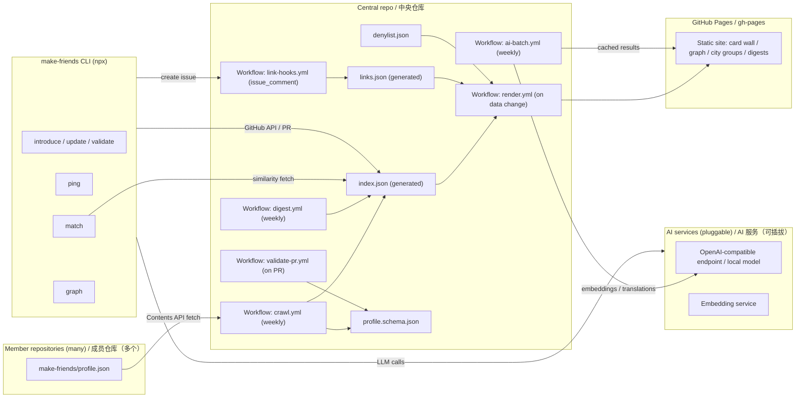

# make-friends Technical Architecture
# make-friends 技术架构

| Field / 字段 | Value / 内容 |
|---|---|
| Version / 版本 | v1.0 (Draft / 草案) |
| Date / 日期 | 2026-08-13 |
| Status / 状态 | Draft for review / 待评审 |
| Language / 语言 | English / 中文 bilingual, section-by-section |
| Related docs / 关联文档 | [PRD.md](./PRD.md), [Protocol-SPEC.md](./Protocol-SPEC.md), [UX.md](./UX.md) |

---

## Executive Summary / 摘要

**English:** make-friends runs entirely on GitHub-native infrastructure: member repositories (data), a central index repository (aggregation, validation, interaction hub), GitHub Actions (scheduled and event-driven workflows), and GitHub Pages (rendered site). A Node.js/TypeScript CLI (`npx make-friends`) provides terminal-native onboarding and interaction. AI capabilities (guided onboarding, translation, semantic matching, icebreakers) are provider-agnostic integrations invoked from the CLI and Actions. There is no dedicated server; all state lives in git repositories and GitHub issues.

**中文:** make-friends 完全运行在 GitHub 原生基础设施上：成员仓库（数据）、中央索引仓库（聚合、校验、互动中枢）、GitHub Actions（定时与事件驱动工作流）以及 GitHub Pages（渲染站点）。Node.js/TypeScript CLI（`npx make-friends`）提供终端原生的注册与互动。AI 能力（引导填写、翻译、语义匹配、破冰建议）是与供应商无关的集成，由 CLI 与 Actions 调用。没有专用服务器；所有状态都存在于 git 仓库与 GitHub issue 中。

---

## 1. Overall Architecture / 总体架构

**English:** Component diagram:

**中文:** 组件图：



**English:** Data flow summary (all automated):

**中文:** 数据流摘要（全部自动化）：

1. Members own `make-friends/profile.json` in their repos (Protocol-SPEC §2).
2. `crawl.yml` (weekly) fetches and validates all member profiles, regenerating `index.json`.
3. `render.yml` (on data change) builds the static site and deploys to `gh-pages`.
4. `link-hooks.yml` (on issue comments) processes `/link` and `/unlink`, maintaining `links.json`.
5. `digest.yml` (weekly) posts the digest issue; `ai-batch.yml` (weekly) computes embeddings/translations.
6. The CLI interacts with the same APIs, always through standard PR/issue flows.

---

## 2. Repository Layout / 仓库结构

**English:** Central repository layout:

**中文:** 中央仓库结构：

```
make-friends/                        # central repo
├── README.md                        # the git-gesture mapping table + joining guide
├── profile.schema.json              # authoritative schema (Protocol-SPEC §2.2)
├── profile.schema.v1.0.json         # archived schema per major version
├── index.json                       # generated by crawl.yml (Protocol-SPEC §3.2)
├── links.json                       # generated by link-hooks.yml (Protocol-SPEC §4.3)
├── links-archive.json               # tombstones for audit
├── denylist.json                    # maintainer-managed (Protocol-SPEC §3.5)
├── requests/
│   ├── new-member.md                # join requests (PR-driven)
│   └── ping-template.md             # issue template for Ping
├── site/                            # static site source (Astro)
│   └── src/
├── scripts/                         # shared Node/TS automation
│   ├── crawl/
│   ├── validate/
│   ├── render/
│   ├── links/
│   └── ai/
├── .github/
│   ├── workflows/                   # see §3
│   └── ISSUE_TEMPLATE/
└── docs/                            # PRD, Protocol-SPEC, Architecture, UX
```

**English:** Member repository layout (minimal):

**中文:** 成员仓库结构（最小化）：

```
member-repo/
├── make-friends/
│   ├── profile.json                 # the protocol document
│   └── avatar.png                   # optional; served from the repo
└── README.md                        # optional badge (PRD FR-16)
```

**English:** Tooling monorepo (optional, separate from the central repo):

**中文:** 工具链 monorepo（可选，独立于中央仓库）：

```
make-friends-tools/
├── packages/
│   ├── cli/                         # npx make-friends
│   ├── shared/                      # schema types, validators, issue parsing
│   └── actions/                     # reusable composite actions for workflows
└── package.json
```

---

## 3. GitHub Actions Workflows / GitHub Actions 工作流

**English:** Workflow permissions follow least-privilege: `contents: read` for read-only jobs; `issues: write` for link hooks; `contents: write` + `pages` only in the render job. Tokens with repo-write scope are stored in Actions secrets (never in the repo).

**中文:** 工作流权限遵循最小权限原则：只读作业使用 `contents: read`；链接钩子使用 `issues: write`；仅在渲染作业中使用 `contents: write` + `pages`。具有仓库写权限的 token 存储在 Actions secrets 中（绝不入库）。

### 3.1 crawl.yml — Weekly Index Crawl / 每周索引抓取

**English:** Scheduled weekly (e.g., Monday 00:30 UTC), plus manual dispatch. Steps:

**中文:** 每周定时（如周一 00:30 UTC），支持手动触发。步骤：

1. Load `index.json` + `denylist.json`.
2. For each member: fetch `profilePath` via Contents API (conditional requests; 404 → mark removed, 403 → skip with note).
3. Validate each profile against `profile.schema.json` + content rule engine (spam rules, §7).
4. Regenerate `index.json` with `valid` / `lastValidationError` / `updatedAt`.
5. Commit the result; on validation regressions, open a report issue (`[validation] <username>`).
6. Failure isolation: wrap each member fetch in try/catch; partial results commit normally.

### 3.2 validate-pr.yml — PR Validation / PR 校验

**English:** Triggered on PRs touching `index.json`, `denylist.json`, or schema files. Runs the same schema + content rules plus: denylist cross-check, email/phone regex scan, https-only link check, repo-ownership plausibility (via the GitHub API user lookup). Comments the result on the PR; human approval still required for index additions (PRD FR-06).

**中文:** 在触及 `index.json`、`denylist.json` 或 Schema 文件的 PR 上触发。运行相同的 Schema + 内容规则，外加：denylist 交叉检查、邮箱/电话正则扫描、仅 https 链接检查、仓库归属合理性（通过 GitHub API 用户查询）。结果以评论形式反馈到 PR；索引新增仍需要人工批准（PRD FR-06）。

### 3.3 link-hooks.yml — /link and /unlink Processing / Link 处理

**English:** Triggered on `issue_comment` events. Steps:

**中文:** 在 `issue_comment` 事件上触发。步骤：

1. If the issue title matches `^\[ping\] `, parse the comment.
2. On `/link`: record the confirming side; when both sides confirmed (distinct authors), append to `links.json` (canonical ordering, Protocol-SPEC §4.3) and post a confirmation comment with a pointer to the graph page.
3. On `/unlink`: require both sides; on completion, move the entry to `links-archive.json` and comment.
4. Idempotency: the Action stores processed comment IDs in a `processed-comments.json` state file to avoid double-processing on retries.

### 3.4 render.yml — Static Site Build & Deploy / 静态站点构建与部署

**English:** Triggered on push to `index.json`, `links.json`, `denylist.json`, or `site/**`. Builds the Astro site (incremental: only changed cards re-render) and deploys to `gh-pages`. Includes the AI enrichment step (translations, semantic similarities) reading cached outputs from `site/.data/ai-cache.json`.

**中文:** 在 `index.json`、`links.json`、`denylist.json` 或 `site/**` 变更时触发。构建 Astro 站点（增量：仅重渲染变更的卡片）并部署到 `gh-pages`。包含 AI 增强步骤（翻译、语义相似度），读取 `site/.data/ai-cache.json` 中的缓存输出。

### 3.5 digest.yml — Weekly Digest / 每周 Digest

**English:** Scheduled weekly (e.g., Friday 08:00 UTC). For each active member: new city-mates, top-5 smallest-fate-diff profiles, friends' updates, unanswered Pings older than 7 days. Publishes a single community digest issue (mention-heavy) or per-city digests at scale (batching limit: one mention per member per digest).

**中文:** 每周定时（如周五 08:00 UTC）。为每个活跃成员生成：同城新成员、缘分 diff 最小的前 5 人、朋友的动态、超过 7 天未回应的 Ping。发布单篇社区 Digest issue（@ 较多）或规模化后按城市分篇（批处理限制：每期 Digest 每位成员至多被 @ 一次）。

### 3.6 ai-batch.yml — AI Enrichment (batch) / AI 批量增强

**English:** Scheduled weekly, after crawl. Two jobs:

**中文:** 每周定时，在抓取之后运行。两个作业：

1. **Translations:** batch-translate profiles into supported languages (en, zh initially) with a machine-translation disclaimer; cache by `{username, profile_hash, lang}`.
2. **Semantic embeddings:** embed `interests` + `bio` per profile; compute pairwise similarity for candidates sharing `lookingFor`; store top-N per member in `ai-cache.json` to power `match` and recommendations (PRD FR-09/FR-14).

**English:** Cost guardrails: cap LLM calls per run (e.g., 500), cache by content hash, retry with exponential backoff, and skip members who opted out (`"ai": {"translate": false, "match": false}` — an optional profile field reserved for a future minor protocol version).

**中文:** 成本护栏：每次运行限制 LLM 调用量（如 500 次）、按内容哈希缓存、指数退避重试，并跳过选择退出的成员（`"ai": {"translate": false, "match": false}`——为未来次版本协议预留的可选 profile 字段）。

---

## 4. GitHub Pages Site / GitHub Pages 站点

**English:** Static site built with Astro (content-driven, zero-JS by default, strong escaping by design). Pages:

**中文:** 使用 Astro 构建的静态站点（内容驱动、默认零 JS、天然强转义）。页面：

| Page / 页面 | Route / 路由 | Data source / 数据源 | Notes / 说明 |
|---|---|---|---|
| Card wall / 卡片墙 | `/` | `index.json` | Filterable grid; lazy-loaded cards; server-side filters via query params |
| Member detail / 成员详情 | `/members/<username>/` | profile fetched at build time | Translated views (FR-13), links preview, Ping button |
| Relationship graph / 关系图谱 | `/graph/` | `links.json` | d3-force; community + ego views; client-side filter |
| City groups / 城市小组 | `/cities/<city>/` | `index.json` aggregated | Group page + meetup discussion link |
| Fate diff / 缘分 diff | `/fate/<a>/<b>/` | two profiles | Overlap highlighting (visual diff) |
| Digest archive / Digest 归档 | `/digests/` | digest issues | Rendered from issue bodies |

**English:** Performance measures (NFR-03): static pre-rendering, per-card lazy loading, image `loading="lazy"`, no third-party scripts, and a CDN (GitHub Pages default). At 10k members, cards are chunked into paginated JSON (`index.chunk.N.json`) so the homepage stays under 3s.

**中文:** 性能措施（NFR-03）：静态预渲染、卡片懒加载、图片 `loading="lazy"`、无第三方脚本、CDN（GitHub Pages 默认）。成员达 1 万时，卡片分块为分页 JSON（`index.chunk.N.json`），确保首页保持在 3 秒内。

---

## 5. CLI Design / CLI 设计

**English:** `make-friends` is a Node.js/TypeScript CLI distributed via `npx`, using `octokit` for GitHub API access. Authentication: reuse an existing `gh` CLI token, or OAuth Device Flow (no client secret on the user's machine).

**中文:** `make-friends` 是通过 `npx` 分发的 Node.js/TypeScript CLI，使用 `octokit` 访问 GitHub API。认证：复用现有 `gh` CLI token，或 OAuth Device Flow（用户机器上不保存客户端密钥）。

### 5.1 Commands / 命令

| Command / 命令 | Function / 功能 | Key steps / 关键步骤 |
|---|---|---|
| `introduce` | Guided onboarding (FR-08/FR-12) | Interactive questions (or `--ai` conversation) → generate `make-friends/profile.json` → local `validate` → open PR to own repo (federated) or to central index |
| `update` | Refresh profile | Same as introduce with existing values as defaults |
| `validate` | Local validation | Schema + content rules without network |
| `ping <username>` | Create Ping issue (FR-03) | Lookup target in index → prefill issue template → create via API |
| `match` | Ranked candidates (FR-09) | Fetch `ai-cache.json` top-N + local field-overlap scoring → print ranked table |
| `graph` | Open graph page | Resolve site URL → open browser |
| `badge` | Generate embeddable SVG badge (FR-16) | Fetch interaction stats → render SVG → print embed snippet |

### 5.2 Architecture / 结构

**English:** Layered design: `packages/shared` (schema types, validators, issue-template parsing — shared with Actions), `packages/cli` (interactive UI, auth, API calls), `packages/actions` (reusable composite actions). AI calls go through a small provider-agnostic adapter (any OpenAI-compatible endpoint, configurable via env vars or a prompt-file in the repo).

**中文:** 分层设计：`packages/shared`（Schema 类型、校验器、issue 模板解析——与 Actions 共享）、`packages/cli`（交互 UI、认证、API 调用）、`packages/actions`（可复用复合 Action）。AI 调用通过一个小的供应商无关适配器（任何 OpenAI 兼容端点，可通过环境变量或仓库中的 prompt 文件配置）。

---

## 6. AI Integration / AI 集成

**English:** AI is additive, never required. Three integration points:

**中文:** AI 是增强，不是必需。三个集成点：

| Capability / 能力 | Where / 位置 | Contract / 契约 |
|---|---|---|
| Guided onboarding / 引导填写 (FR-12) | CLI `introduce --ai` | Conversational Q&A → structured JSON draft; user reviews before any write |
| Translation / 翻译 (FR-13) | `ai-batch.yml` + site | `{username, profile_hash, lang}` cached translations; disclaimer required |
| Semantic matching / 语义匹配 (FR-14) | `ai-batch.yml` | Embeddings → cosine similarity → top-N per member in `ai-cache.json` |
| Icebreaker / 破冰 (FR-15) | CLI `ping --ai` + site button | Both profiles in → 1–2 suggested opening lines (user-editable) |

**English:** Privacy contract for AI (NFR-01): profile content is public by definition; still, the CLI MUST inform the user before sending profile data to a third-party LLM endpoint, and local-model users can skip network calls entirely. The AI cache lives in the central repo's data directory and is treated as derived public data.

**中文:** AI 隐私契约（NFR-01）：profile 内容按定义是公开的；但 CLI 在将 profile 数据发送到第三方 LLM 端点之前必须告知用户，使用本地模型的用户可完全跳过网络调用。AI 缓存存放在中央仓库数据目录中，按衍生公开数据处理。

---

## 7. Security & Anti-Spam Design / 安全与反垃圾设计

### 7.1 Security Controls / 安全控制

| Threat / 威胁 | Control / 控制措施 |
|---|---|
| XSS via profile content | Astro's default HTML escaping; `bio` and `interests` rendered as text; no raw HTML anywhere |
| Phishing / malicious links | https-only schema constraint; domain reputation check (blocklist + optional safebrowsing-style lookup); `projectLinks` rendered with `rel="noopener noreferrer nofollow"` |
| Malicious PRs to the central repo | validate-pr.yml gates; human approval for index additions; denylist as final recourse |
| Token compromise | Least-privilege workflow permissions; tokens only in secrets; CLI uses Device Flow (no long-lived user tokens stored) |
| Supply chain (CLI) | Lockfile + provenance attestation on npm publish; `npm audit` in CI; Actions pin by commit SHA |
| Data exfiltration via profile fields | `additionalProperties: false` in the schema; max field lengths; content rules reject suspicious patterns |

### 7.2 Content Rule Engine / 内容规则引擎

**English:** Configurable rules (JSON) evaluated by both validate-pr.yml and crawl.yml:

**中文:** 可配置规则（JSON），由 validate-pr.yml 和 crawl.yml 共同评估：

```jsonc
{
  "rules": [
    { "id": "min-bio-or-structured", "kind": "presence", "detail": "reject profiles with zero structured fields beyond required set" },
    { "id": "max-links", "kind": "count", "field": "projectLinks", "max": 5 },
    { "id": "placeholder-text", "kind": "regex", "field": "bio", "pattern": "^(lorem ipsum|tbd|todo|test|placeholder)$" },
    { "id": "email-in-text", "kind": "regex", "field": "*", "pattern": "[\\w.+-]+@[\\w-]+\\.[\\w.]+" },
    { "id": "phone-in-text", "kind": "regex", "field": "*", "pattern": "\\+?\\d{8,15}" },
    { "id": "domain-blocklist", "kind": "url", "field": "projectLinks", "blocklist": ["spam.example"] },
    { "id": "duplicate-content", "kind": "hash", "field": "*", "detail": "content hash collision with existing member => flagged" }
  ]
}
```

### 7.3 Rate Limiting & Human Review / 速率限制与人工审核

**English:** (1) New index entries require human approval (one-time gate). (2) A single member's profile may be updated at most once per crawl cycle (7 days) — enforced by the crawler's `updatedAt` diffing; urgent fixes via issue request. (3) Denylisted members are excluded from all rendering, recommendation, and digest paths. (4) Ping issues are rate-limited per sender (e.g., ≤ 3 open Pings per day) via a lint check in link-hooks.yml.

**中文:** (1) 新索引条目需要人工批准（一次性门槛）。(2) 单个成员的 profile 每抓取周期（7 天）至多更新一次——由抓取器的 `updatedAt` 差异比较执行；紧急修复通过 issue 申请。(3) 被拉黑成员从所有渲染、推荐与 Digest 路径中排除。(4) Ping issue 按发送者限速（如每天 ≤ 3 个未关闭 Ping），由 link-hooks.yml 中的 lint 检查执行。

---

## 8. Scalability / 可扩展性

| Dimension / 维度 | Estimate at 10k members / 1 万成员时估算 | Mitigation / 缓解措施 |
|---|---|---|
| Index size / 索引体积 | ~10k × 0.3 KB ≈ 3 MB JSON | Trivial for git; chunked JSON for the site |
| Crawl time / 抓取时间 | 10k Contents API calls (rate limit 5k/hr) | Conditional requests (ETag/`If-None-Match`), 404-shortcuts, split across two runs, or a `curl`-friendly raw.githubusercontent fetch path |
| Render time / 渲染时间 | 10k cards ≈ minutes | Incremental build (only changed profiles); chunked pages |
| Digest mentions / Digest @ 数量 | 10k members → 10k mentions | Per-city digests; opt-in digest field (future minor version) |
| Actions cost / Actions 成本 | Weekly crawl+render+AI within free tier (2k min/mo for public repos) | Batch AI calls, cache by hash, skip unchanged profiles |
| Human review load / 人工审核量 | One-time entry gate + edge cases | Fully automated validation covers ~95% of submissions (target, PRD §6) |

---

## 9. Observability / 可观测性

**English:** No servers means no traditional metrics; observability is built from git artifacts:

**中文:** 没有服务器意味着没有传统指标；可观测性由 git 制品构成：

- `index.json` commit history = crawl health (regressions visible as `valid: false` spikes)
- `links-archive.json` = relationship churn audit
- `[validation]` report issues = content quality tracker
- A monthly `[metrics]` issue (generated by a workflow) summarizes PRD §6 success metrics from these artifacts — this issue doubles as the community report card
