# make-friends Interaction Design (UX)
# make-friends 交互设计

| Field / 字段 | Value / 内容 |
|---|---|
| Version / 版本 | v1.0 (Draft / 草案) |
| Date / 日期 | 2026-08-13 |
| Status / 状态 | Draft for review / 待评审 |
| Language / 语言 | English / 中文 bilingual, section-by-section |
| Related docs / 关联文档 | [PRD.md](./PRD.md), [Protocol-SPEC.md](./Protocol-SPEC.md), [Architecture.md](./Architecture.md) |

---

## Executive Summary / 摘要

**English:** This document specifies the user experience of make-friends across four surfaces: the GitHub-native journey (issues, PRs), the rendered card-wall site, the CLI, and the AI-assisted flows. The experience is designed around three emotional beats: the ritual of committing yourself (onboarding), the delight of serendipity (discovery and Ping), and the ceremony of a merged friendship (Link). Every flow minimizes friction for the common path and keeps the git metaphor visible.

**中文:** 本文档规定 make-friends 在四个界面的用户体验：GitHub 原生旅程（issue、PR）、渲染卡片墙站点、CLI 与 AI 辅助流程。体验围绕三个情感节拍设计：提交自己的仪式感（注册）、不期而遇的惊喜（发现与 Ping）、关系合并的仪式（Link）。每条流程都为常见路径最小化摩擦，并让 git 隐喻始终可见。

---

## 1. First-Time Participation Journey / 首次参与旅程

**English:** The journey from discovery to first interaction:

**中文:** 从发现到首次互动的完整旅程：

```mermaid
flowchart LR
    A["Discover: README / badge / word of mouth"] --> B["Understand: git-gesture table"]
    B --> C["Onboard: CLI introduce or web guide"]
    C --> D["Own: profile.json lands in MY repo"]
    D --> E["Appear: next crawl adds me to the wall"]
    E --> F["Explore: filters, fate diff, mystery friend"]
    F --> G["Interact: first Ping out or in"]
    G --> H["Ritual: first Link merged"]
```



**English:** Emotional design notes per stage:

**中文:** 各阶段的情感设计要点：

| Stage / 阶段 | Emotion to evoke / 情感目标 | Design levers / 设计杠杆 |
|---|---|---|
| Discover / 发现 | Curiosity / 好奇 | The README's gesture table is the hook; badges on members' profiles are the viral loop |
| Onboard / 注册 | Agency, not friction / 掌控感 | Under 5 minutes; AI-guided for writers' block; every step is editable |
| Own / 归属 | Ownership / 归属感 | "Your data lives in your repository" is stated literally at the end of onboarding |
| Appear / 出现 | Anticipation / 期待 | "You will appear on the wall at the next crawl (within 7 days)" — concrete expectation setting |
| Interact / 互动 | Serendipity / 惊喜 | Low-commitment Ping; AI icebreaker; mystery friend for the shy |
| Ritual / 仪式 | Belonging / 归属感 | The Link confirmation message uses merge language: "friendship merged" |

### 1.1 Web Guided Flow / 网页引导流程（非开发者通道）

**English:** For non-CLI users, the site offers a "Create your profile" wizard that collects fields and outputs either (a) a ready-to-push JSON + step-by-step push instructions, or (b) an auto-generated PR via the GitHub OAuth App flow (Device Flow for CLI is preferred; the web wizard uses a serverless-friendly OAuth app). Either path ends with the same "Your data lives in your repository" statement.

**中文:** 面向非 CLI 用户，站点提供"创建你的 profile"向导：收集字段后输出 (a) 可直接推送的 JSON + 分步推送说明，或 (b) 通过 GitHub OAuth App 流程自动生成 PR（CLI 优先使用 Device Flow；Web 向导使用 serverless 友好的 OAuth 应用）。两条路径都以"你的数据存放在你的仓库中"声明收尾。

---

## 2. Card Wall: Information Architecture / 卡片墙：信息架构

**English:** The homepage is the community's front door. Layout (top to bottom):

**中文:** 首页是社区的门面。布局（自上而下）：

1. **Hero** — one-line value proposition + the gesture table teaser ("a commit is an introduction") + primary CTA ("Introduce yourself").
2. **Filter bar** — purpose (`lookingFor` chips), language (`speaks`), city, interests (token input); state lives in the URL query string (shareable filter links).
3. **Member grid** — responsive cards, lazy-loaded, sorted by recent `updatedAt`; each card shows: avatar, name, local-time badge (from `timezone`), purpose chips, top interests, a "Say hi" (Ping) button, and a "fate diff" link (compare with you).
4. **Side panel** (desktop) — "Mystery friend of the day" (FR-17), digest teaser, city-group shortcuts.

### 2.1 Card Design / 卡片设计

```
+---------------------------------------------------+
| (avatar) Alice        [UTC+8] it is 21:40 there   |
| @alice-dev                                        |
|                                                   |
| Purpose:  [collaborator] [language-partner]       |
|           [local-friend]                          |
| Interests: rust  ai  drumming  climbing           |
|                                                   |
| [Say hi]   [Compare our fate]                     |
+---------------------------------------------------+
```

**English:** Design rules: purpose chips use consistent color mapping (one color per `lookingFor` value, used everywhere — site, CLI, issues); the time badge is the first thing a global user checks; the Ping button is the only primary action on the card (one CTA principle).

**中文:** 设计规则：目的标签使用一致的配色映射（每个 `lookingFor` 值一种颜色，在站点、CLI、issue 中统一使用）；时间徽章是全球用户最先查看的信息；Ping 按钮是卡片上唯一的首要操作（单一 CTA 原则）。

### 2.2 Member Detail Page / 成员详情页

**English:** `/members/<username>/` shows: full profile fields, `offer` section ("What they offer"), links preview (friend count + names), translation selector (FR-13), Ping button, and an activity trail (their public issues/links history — the git history as social track record). A privacy card at the bottom restates: "This data is public and lives in <member>'s own repository."

**中文:** `/members/<username>/` 展示：完整 profile 字段、"我可以提供"区块、关系预览（好友数量与名字）、翻译选择器（FR-13）、Ping 按钮，以及活动轨迹（其公开 issue/关系历史——git 历史即社交履历）。底部有一张隐私卡片重申："此数据公开，存放于 <成员> 自有仓库。"

---

## 3. Ping → Reply → Link: Interaction Flows / 互动流程

### 3.1 Ping Flow / Ping 流程

**English:** One click from any surface (card, detail page, CLI). The site opens the pre-filled issue creation page (GitHub UI as the compose surface — no custom editor to build or maintain):

**中文:** 从任何界面（卡片、详情页、CLI）一键发起。站点打开预填的 issue 创建页（用 GitHub UI 作为撰写界面——无需自建或维护自定义编辑器）：

1. User clicks "Say hi" → redirected to `issues/new?template=ping.yml` with `@<target>` and the source-profile block pre-filled (Protocol-SPEC §4.1).
2. Optional: "Suggest an opener" (AI, FR-15) fills the free-text area with an editable suggestion.
3. User submits → target receives a native GitHub notification.
4. **Microcopy matters:** the template's first line is "This is a public conversation — no email needed." (sets expectations, privacy-aligned).

### 3.2 Reply Flow / 回应流程

**English:** Replying is just commenting on the issue. No UI to build. The design constraint is conversational tone in the template ("reply here; a `/link` makes it official").

**中文:** 回应就是在 issue 中评论，无需构建 UI。设计约束是模板中的对话语气（"在此回复；输入 `/link` 即可正式确立关系"）。

### 3.3 Link Flow / Link 流程

**English:** The ceremony, rendered in the issue thread:

**中文:** 仪式在 issue 线程中的呈现：

1. Alice posts `/link`. The bot comments: "Alice wants to merge this friendship. Bob, reply `/link` to confirm."
2. Bob posts `/link`. The bot comments: "Friendship merged. Alice and Bob are now linked. See you on the graph: <graph URL>" — with the two profile links.
3. Both members optionally update their `profile.json` `links` field (the CLI `update` command offers this as a one-keystroke step: "Add alice-dev to your links? [Y/n]").

**English:** Tone guidance for bot messages: use merge vocabulary, keep it short, never add emoji, and always link the graph page. Unlink mirrors the flow with `/unlink` and a tombstone note ("this link was archived on <date>").

**中文:** 机器人消息的语气指引：使用 merge 词汇、保持简短、不使用 emoji、始终链接图谱页面。Unlink 镜像该流程，使用 `/unlink` 并附墓碑说明（"此关系已于 <日期> 归档"）。

### 3.4 Notification Design / 通知设计

**English:** All notifications are GitHub-native (web + email). Design rule: never build a parallel notification system; instead, shape the issue templates so that notifications are self-explanatory (title always starts with `[ping]`, `[link]`, or `[validation]` so a notification can be triaged at a glance).

**中文:** 所有通知均为 GitHub 原生（网页 + 邮件）。设计规则：绝不构建平行通知系统；而是塑造 issue 模板，使通知自解释（标题始终以 `[ping]`、`[link]` 或 `[validation]` 开头，通知一眼即可分拣）。

---

## 4. Relationship Graph UX / 关系图谱交互

**English:** `/graph/` renders `links.json` as a force-directed graph.

**中文:** `/graph/` 将 `links.json` 渲染为力导向图。

**Interaction rules / 交互规则：**

- **Community view:** all nodes + edges, color-coded by dominant `lookingFor`; drag to explore; scroll to zoom; hover shows a mini-card (avatar, name, local time).
- **Ego view** (`/graph/?ego=alice-dev`): first-degree friends highlighted, second-degree dimmed-but-visible — the weak-link discovery surface ("friends of friends").
- **Filtering:** by purpose, city, and language; filtered subgraphs persist in the URL.
- **Accessibility (NFR-05):** the graph has a list fallback (a sortable table of connections) for keyboard/screen-reader users; graph interactions are optional enhancements.
- **Empty-state design:** a new member with zero links sees a friendly prompt: "Your graph is empty — that's the fun part. Say hi to someone with a matching purpose." with the filter pre-set to their own `lookingFor`.

---

## 5. CLI Interaction Design / CLI 交互设计

**English:** The CLI is the terminal-native surface. All output follows a consistent style: commands are verbs, questions are one-at-a-time, defaults are always shown, and no output ever claims success before the API confirms it.

**中文:** CLI 是终端原生界面。所有输出遵循一致风格：命令是动词、问题一次一个、始终显示默认值、在 API 确认前绝不声称成功。

### 5.1 `introduce` (guided) / 引导式注册

```
$ npx make-friends introduce
? This profile will be public and stored in YOUR repository. Continue? Yes
? Display name: Alice
? Timezone (UTC+8): UTC+8
? City (city-level only): Shanghai
? Languages you speak (comma-sep): zh, en
? Languages you want to practice: ja
? What are you looking for? (multi-select, arrows + space)
  ❯ ◉ collaborator
    ◯ language-partner
    ◉ local-friend
    ◯ mentor
    ◯ chat
? Interests (comma-sep): rust, ai, drumming
? Your repo: alice-dev/make-friends-profile
? Add make-friends/profile.json to that repo and open a PR? Yes

✓ Generated make-friends/profile.json (validated against schema v1.0)
✓ PR opened: https://github.com/alice-dev/make-friends-profile/pull/1
→ Your data lives in YOUR repository. You will appear on the wall at the next crawl (within 7 days).
```

**English:** Design notes: the publicness notice is the FIRST question; defaults are smart (timezone from local system); multi-select uses arrow keys; the final message restates ownership and sets crawl expectations.

**中文:** 设计要点：公开性声明是第一个问题；默认值智能（时区取自本机系统）；多选用方向键；最后一条消息重申数据归属并设定抓取预期。

### 5.2 `ping <username>` / 打招呼

```
$ npx make-friends ping alice-dev
? Opening line (leave empty for AI suggestion): I see you're into rust and Shanghai-based — want to pair on a side project?
✓ Ping issue created: https://github.com/make-friends-globally/make-friends/issues/12
→ Alice will get a GitHub notification. This conversation is public.
```

### 5.3 `match` / 匹配推荐

```
$ npx make-friends match --limit 5
Rank  Similarity  User          Why
1     92%         bob-dev       Same purpose [collaborator], 3 shared interests, offers code-review
2     87%         carol-dev     Same purpose [chat], 2 shared interests, same timezone
3     74%         dave-dev      Friends-of-friend (via alice-dev), shared interest: ai
4     68%         erin-dev      Same city, wants to practice zh (you speak zh)
5     61%         frank-dev     AI semantic match: "systems performance" ≈ "rust"
→ Run `make-friends ping <user>` to say hi.
```

**English:** The "Why" column is the product: every recommendation must explain itself; "friends-of-friend" edges are surfaced explicitly (weak-link strategy).

**中文:** "原因"列就是产品：每条推荐都必须自我解释；"朋友的 朋友"边被显式呈现（弱连接策略）。

### 5.4 `graph` / 图谱

```
$ npx make-friends graph
✓ Opening https://make-friends-globally.github.io/make-friends/graph/?ego=alice-dev
```

### 5.5 Error & Failure Design / 错误与失败设计

**English:** Error messages are written as next actions, not status reports:

**中文:** 错误消息写成"下一步动作"而非状态报告：

```
✗ Profile not found for "bob-dev"
  → Check the name: `make-friends match` lists valid members.
  → Or the member may have left: their entry is removed at the next crawl.
```

---

## 6. AI-Guided Onboarding Conversation / AI 引导注册对话

**English:** `introduce --ai` replaces the form with a conversation. Sample (terminal):

**中文:** `introduce --ai` 用对话替代表单。示例（终端）：

```
$ npx make-friends introduce --ai
AI> Hi! I'll help you write a make-friends profile. It's public and lives in your own repo.
    Tell me something you're working on these days.
You> I'm building an AI-powered podcast tool and learning Japanese.
AI> Nice. Who would you like to meet? Pick any that apply:
    collaborators, language partners, mentors, mentees, local friends, co-founders, chat.
You> collaborators and language partners, I guess.
AI> What can you offer others? (mentoring, code-review, coffee, language practice, hospitality)
You> code-review and language practice.
... (continues: city, timezone, interests, best time to reach)
AI> Here's your draft. Review and edit anything:

    { ...generated profile.json... }

    Save as make-friends/profile.json and open a PR? [Y/n]
```

**English:** Design rules for the AI: (1) the publicness notice appears before any data collection; (2) it never invents facts — everything it writes must trace to a user statement; (3) it proposes enum values conversationally, mapping natural language to schema values; (4) the final draft is always shown and fully editable; (5) the AI sends data to the configured LLM endpoint only after the user's explicit consent (privacy contract, Architecture §6).

**中文:** AI 的设计规则：(1) 在任何数据收集前先展示公开性声明；(2) 绝不编造事实——它写出的每项内容都必须可追溯到用户陈述；(3) 以对话方式提出枚举值，将自然语言映射到 Schema 值；(4) 最终草稿始终展示且完全可编辑；(5) 仅在用户明确同意后，AI 才会将数据发送到配置的 LLM 端点（隐私契约，Architecture §6）。

---

## 7. Gamification / 游戏化

### 7.1 Badge Rules / 徽章规则

**English:** Badges are SVGs derived from public interaction history, embeddable in personal READMEs (free viral channel). Rendering is deterministic (same history → same badge), so badges are honest.

**中文:** 徽章是由公开互动历史派生的 SVG，可嵌入个人 README（免费病毒传播渠道）。渲染是确定性的（相同历史 → 相同徽章），因此徽章是诚实的。

| Badge / 徽章 | Earn condition / 获得条件 |
|---|---|
| `introduced` / 已自我介绍 | Profile in the index |
| `pinged` / 被 Ping 过 | Received ≥ 1 Ping |
| `linked` / 已建立关系 | First Link |
| `friend-10` / 十友 | 10 links |
| `streak-30` / 三十天连击 | Interaction (profile update, Ping, Link) on 30 distinct days |
| `fate-champion` / 缘分之王 | Appears in ≥ 10 members' top-fate lists in one month |
| `city-maker` / 城市开拓者 | First member to join a city that reaches 10 members |

**English:** Display: a compact `` snippet is printed by `make-friends badge`; the site's member page shows the badge shelf. Never gated features behind badges (no dark patterns).

**中文:** 展示：`make-friends badge` 输出紧凑的 `` 片段；站点成员页展示徽章架。绝不用徽章锁功能（无暗黑模式）。

### 7.2 Mystery Friend / 盲盒朋友

**English:** Daily on the homepage: one random member card with a "Say hi" button and a one-line tagline ("Today's mystery friend: a drummer in Shanghai who writes Rust"). Rules: (1) random but never self, never denylisted, never already linked; (2) replaces on refresh at most once per session to keep the "this is today's pick" feeling; (3) explicitly framed as optional serendipity.

**中文:** 首页每日一张：随机一位成员卡片 + "Say hi" 按钮 + 一句简介（"今日盲盒朋友：上海一位写 Rust 的鼓手"）。规则：(1) 随机但绝不是自己、绝不来自 denylist、绝不已是好友；(2) 每次会话至多刷新更换一次，以保留"这是今天的推荐"感；(3) 明确标注为可选惊喜。

### 7.3 Fate Diff / 缘分 diff

**English:** `/fate/<a>/<b>/` renders a visual diff of two profiles: matching fields highlighted as "shared", differing values listed side by side, missing fields shown as "theirs only". The metaphor is literal: this is a diff view, because "our diff is small" is the community's romantic phrase. A shareable CTA: "Compare with anyone on the wall."

**中文:** `/fate/<a>/<b>/` 渲染两个 profile 的可视化 diff：相同字段高亮为"共有"，不同值并列展示，缺失字段显示为"仅对方有"。隐喻是字面的：这就是一个 diff 视图，因为"我们的 diff 很小"是社区的浪漫用语。附带可分享 CTA："与墙上任意成员比较"。

---

## 8. Empty, First-Use & Edge States / 空状态、首次使用与边界状态

**English:** Every empty state teaches the next action:

**中文:** 每个空状态都引导下一个动作：

| State / 状态 | Message / 文案 | Next action / 下一步 |
|---|---|---|
| No members in your city yet / 城市暂无成员 | "Be the first in <city>" | Introduce yourself (sets `city`) |
| Your graph is empty / 关系图为空 | "Your graph is empty — that's the fun part" | Filter by your `lookingFor` and Ping someone |
| No match results / 无匹配结果 | "Expand your interests or try 'chat'" | Edit profile via `update` |
| Member left / 成员已离开 | "This member removed their profile" | Show cached snapshot with removal date (no Ping button) |
| Validation rejected / 校验被拒 | "Your profile needs fixes: <errors>" | Link to validator output + docs |

**English:** Edge cases handled explicitly: profiles of deleted users render as tombstones (no Ping); unverified AI suggestions are labeled "AI suggestion — edit freely"; machine translations always carry the disclaimer.

**中文:** 边界情况显式处理：已删除用户的 profile 渲染为墓碑（无 Ping 按钮）；未经验证的 AI 建议标注"AI 建议——可自由编辑"；机器翻译始终附声明。

---

## 9. Accessibility & i18n / 可访问性与国际化

**English:** (1) WCAG 2.1 AA: the card grid is fully keyboard-navigable; purpose chips use color + icon (not color alone); the graph has a table fallback (see §4). (2) i18n: site UI ships in English and Chinese (language toggle); profile content is translated on demand via FR-13; the CLI prompts are English-first with a `--lang zh` option. (3) Reduced motion: graph animations and card hover effects respect `prefers-reduced-motion`.

**中文:** (1) WCAG 2.1 AA：卡片网格完全可键盘导航；目的标签使用颜色 + 图标（而非仅颜色）；图谱有表格回退（见 §4）。(2) i18n：站点 UI 提供英文与中文（语言切换）；profile 内容通过 FR-13 按需翻译；CLI 提示默认英文，提供 `--lang zh` 选项。(3) 减少动态：图谱动画与卡片悬停效果尊重 `prefers-reduced-motion`。

---

## 10. Design Principles Checklist / 设计原则检查清单

**English:** A feature ships only when it satisfies all of the following:

**中文:** 一个功能只有在满足以下所有条件时才可发布：

- [ ] Uses git-native surfaces (issues, PRs, commits) rather than custom replacements / 使用 git 原生界面而非自定义替代品
- [ ] Consistent with the gesture mapping table (P1) / 与手势映射表一致（P1）
- [ ] Every interaction has a visible outcome (closed loop, P4) / 每个互动都有可见结果（闭环，P4）
- [ ] Publicness is stated, not assumed / 公开性被明示而非默示
- [ ] Empty states teach the next action / 空状态引导下一步动作
- [ ] No dark patterns; no feature-gating behind gamification / 无暗黑模式；游戏化不锁功能
- [ ] Keyboard-navigable and screen-reader accessible (WCAG 2.1 AA) / 可键盘导航且屏幕阅读器可访问（WCAG 2.1 AA）
